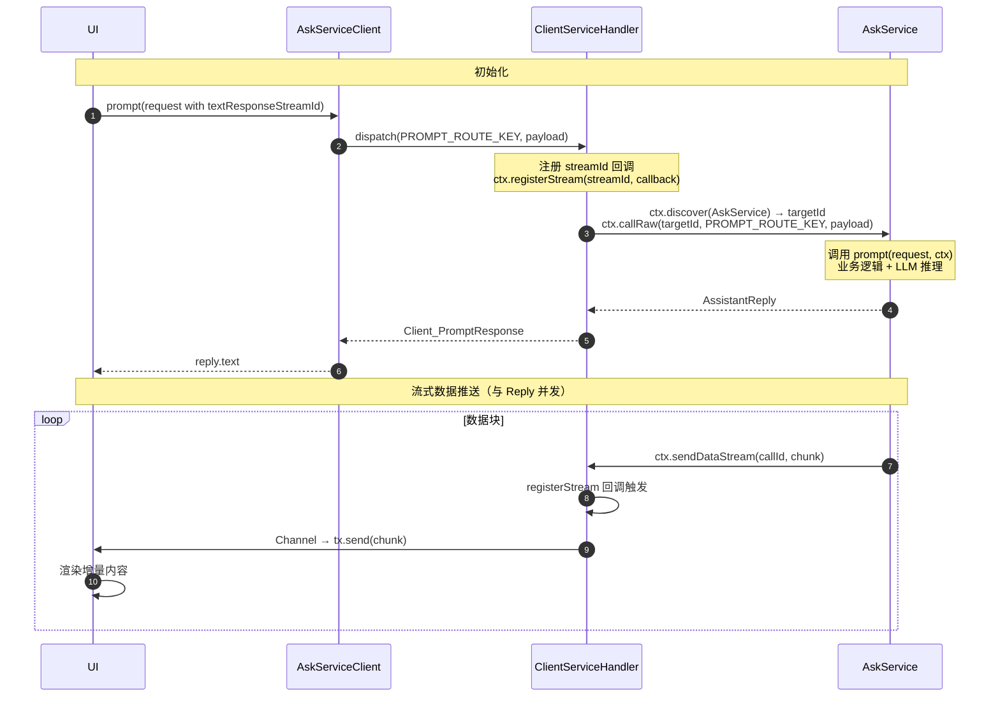
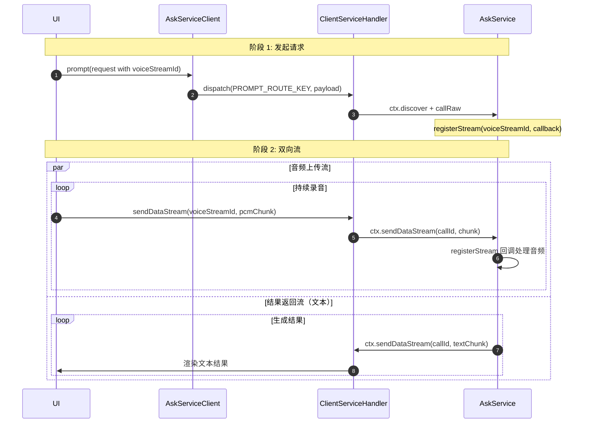

# Usage Guide

基于 [asks-ts](https://github.com/GoAskAway/asks-ts) 和 [askc-ts](https://github.com/GoAskAway/askc-ts) 的完整使用指南。

> **依赖版本**：务必使用最新 `@actor-rtc/actr` 版本。当前基于 `v0.1.17`，检查最新版本：<https://github.com/actor-rtc/actr-ts/releases>

## 架构总览

```
┌──────────────┐       ┌──────────────────┐       ┌──────────────┐
│   askc-ts    │ ────> │  askaway-proto   │ <──── │   asks-ts    │
│  (Client)    │       │  (Proto 定义)     │       │  (Server)    │
└──────┬───────┘       └──────────────────┘       └──────┬───────┘
       │                                                 │
       │         WebRTC (via Actr signaling)             │
       └─────────────────────────────────────────────────┘
```

三层模型：

| 层 | 项目 | 说明 |
| --- | --- | --- |
| 协议定义 | `askaway-proto` | Protobuf 消息和服务定义，两个示例项目通过 git submodule 引用 |
| 远程 Actor | `asks-ts` | `AskService` — 执行业务逻辑，生成数据流 |
| 本地 Actor | `askc-ts` | `AskServiceClient` — 状态桥接，转发请求到远程 AskService |

## 跨平台支持

ACTR 框架提供多语言 SDK，协议定义在 `askaway-proto` 的基础上，可按相同模式实现移动端和原生客户端：

| 语言 | 仓库 |
| --- | --- |
| TypeScript | [actr-ts](https://github.com/actor-rtc/actr-ts) |
| Swift | [actr-swift](https://github.com/actor-rtc/actr-swift) |
| Kotlin | [actr-kotlin](https://github.com/actor-rtc/actr-kotlin) |
| Python | [actr-python](https://github.com/actor-rtc/actr-python) |

> `asks-ts` 与 `askc-ts` 均为参考实现，实际项目中各语言客户端或服务端的协议交互模式与 TypeScript 版本一致。

## 1. 项目初始化

### 1.1 安装 actr-cli

```bash
# macOS / Linux
brew tap actor-rtc/tap && brew install actr-cli

# 从源码安装
cargo install actr-cli

# 更新到最新版本
brew upgrade actr-cli
```

### 1.2 创建项目

`askc-ts` 与 `asks-ts` 是参考实现，克隆预览即可：

```bash
git clone --recurse-submodules git@github.com:GoAskAway/asks-ts.git
git clone --recurse-submodules git@github.com:GoAskAway/askc-ts.git
```

实际开发使用 `actr init` 创建新项目：

```bash
# 创建 asks（服务端）
actr init my-asks \
  --signaling wss://actrix1.develenv.com/signaling/ws \
  --manufacturer askaway1 --language typescript

# 创建 askc（客户端）
actr init my-askc \
  --signaling wss://actrix1.develenv.com/signaling/ws \
  --manufacturer askaway1 --language typescript
```

### 1.3 代码生成

```bash
actr gen -l typescript -i proto -o src/generated
```

`actr gen` 自动完成 proto 解析、类型生成、scaffold 创建。无需 `npm run codegen`。

## 2. 协议定义（askaway-proto）

### ask-service/ask.proto — 远程 AskService

```protobuf
service AskService {
  rpc Prompt(UsrPromptRequest) returns (AssistantReply);
  rpc PrepareAttachmentUpload(PrepareAttachmentUploadRequest) returns (PrepareAttachmentUploadResponse);
}
```

`UsrPromptRequest` 统一处理文本和语音请求。`text` 字段为文本问题，`voiceStreamId` 为语音流 ID，二者选一或组合使用。

`AssistantReply` 包含 `questionId`、`sessionId`、`text`、`statusCode` 和 `errorMessage`。流式数据通过单独的 `sendDataStream` 通道推送，不在这个响应体中。

### client-service/ — 本地 ClientService

定义 Shell/UI 与本地 Actor 之间的接口：

```protobuf
service ClientService {
  rpc Prompt(PromptRequest) returns (PromptResponse);
  rpc PrepareAttachmentUpload(PrepareAttachmentUploadRequest) returns (PrepareAttachmentUploadResponse);
}
```

`PromptRequest` 的 `location` 展平为 `latitude`/`longitude`/`address`/`placeName` 四个独立字段，`ClientServiceHandler` 负责将其映射为 `AskService` 的嵌套 `Location` 消息。

## 3. 配置（Actr.toml）

### 3.1 服务端配置（asks-ts）

```toml
edition = 1
exports = ["askaway-proto/ask-service/ask.proto"]

[package]
name = "ask-service-test"
description = "Ask service actor"

[package.actr_type]
manufacturer = "askaway1"
name = "AskService"

[system.signaling]
url = "wss://actrix1.develenv.com/signaling/ws"

[system.deployment]
realm_id = 2368_266_035

[system.discovery]
visible = true

[system.webrtc]
force_relay = false
stun_urls = ["stun:actrix1.develenv.com:3478"]
turn_urls = ["turn:actrix1.develenv.com:3478"]

[acl]
[[acl.rules]]
permission = "allow"
types = ["askaway1+Client", "acmeopenclaw+AskawayClient"]
```

关键字段：
- `exports`: 声明本服务对外暴露的 proto 文件路径。
- `actr_type.name`: `AskService` — 与客户端 `dependencies` 中的声明匹配。
- `discovery.visible = true`: 允许客户端通过 `ctx.discover()` 发现本服务。
- `acl.rules`: 允许 `askaway1+Client` 类型的 Actor 访问。

### 3.2 客户端配置（askc-ts）

```toml
edition = 1
exports = []

[package]
name = "askc-ts"
description = "Ask client"

[package.actr_type]
manufacturer = "askaway1"
name = "Client"

[dependencies]
ask-service = { actr_type = "askaway1+AskService" }

[system.signaling]
url = "wss://actrix1.develenv.com/signaling/ws"

[system.deployment]
realm_id = 2368_266_035

[system.discovery]
visible = true

[system.webrtc]
force_relay = false
stun_urls = ["stun:actrix1.develenv.com:3478"]
turn_urls = ["turn:actrix1.develenv.com:3478"]

[acl]
[[acl.rules]]
permission = "allow"
types = ["askaway1+AskService", "acmeopenclaw+AskService"]
```

关键字段：
- `dependencies`: 声明依赖的远程服务 `askaway1+AskService`，codegen 会据此生成远程 client 代码。
- `acl.rules`: 允许 `AskService` 类型的 Actor 回连本客户端（用于 `sendDataStream` 反向推送）。
- `exports = []`: 客户端不对外暴露任何服务。

### 3.3 配置路径解析

两个项目都支持通过 `ACTR_CONFIG` 环境变量指定配置文件路径，默认从当前工作目录读取 `Actr.toml`：

```bash
ACTR_CONFIG=/path/to/my-actr.toml actr run
```

## 4. 实现 AskService（服务端）

> `asks-ts` 是参考实现，仅演示核心机制（mock 响应、流式推送骨架）。具体业务逻辑（LLM 调用、存储、语音识别等）需根据实际场景自行替换。

`src/ask_service.ts` 是实现业务逻辑的核心文件，需实现 `AskServiceHandlers` 接口：

### 4.1 prompt — 处理用户提示

```typescript
import type { Context, DataStream, StreamSignal } from '@actor-rtc/actr';
import type { Ask_AssistantReply, Ask_UsrPromptRequest } from './generated/ask.pb.js';
import type { AskServiceHandlers } from './ask_service_runtime.js';

export class AskServiceHandler implements AskServiceHandlers {
  async prompt(request: Ask_UsrPromptRequest, ctx: Context): Promise<Ask_AssistantReply> {
    // 1. 处理音频流（如果有语音输入）
    const voiceStreamId = request.voiceStreamId;
    if (voiceStreamId) {
      await ctx.registerStream(voiceStreamId, (err: Error | null, signal: StreamSignal) => {
        if (err) {
          console.error(`Audio stream ${voiceStreamId} error:`, err);
          return;
        }
        if (!signal) {
          console.log(`Audio stream ${voiceStreamId} finished.`);
          return;
        }
        // signal.chunk.sequence — 序列号
        // signal.chunk.payload — Buffer，音频块数据
        console.log(`Audio chunk seq ${signal.chunk.sequence}`);
      });
    }

    // 2. 业务逻辑：调用 LLM、查询数据库等
    const responseText = await callYourLLM(request.text, request.location);

    // 3. 流式推送结果（如果有 textResponseStreamId）
    const targetActrId = ctx.callId();
    const streamId = request.textResponseStreamId;
    if (targetActrId && streamId) {
      void (async () => {
        for (let i = 0; i < responseChunks.length; i++) {
          const chunk: DataStream = {
            streamId,
            sequence: i + 1,
            payload: Buffer.from(responseChunks[i]),
            metadata: [],
          };
          await ctx.sendDataStream(targetActrId, chunk);
        }
      })();
    }

    return {
      questionId: request.questionId,
      sessionId: request.sessionId,
      text: responseText,
      statusCode: 200,
      errorMessage: '',
    };
  }
}
```

**关键点**：
- `ctx.callId()` 返回发起请求的客户端 Actor ID，流式数据需要推送到这个目标。
- `ctx.registerStream()` 注册流回调——当有语音流时，客户端会通过 `sendDataStream` 推送音频块，回调在此触发。
- `ctx.sendDataStream()` 将数据块推送到指定的客户端。
- 流式推送是异步的，用 `void (async () => { ... })()` 避免阻塞 RPC 响应。

### 4.2 prepareAttachmentUpload — 准备附件上传流

```typescript
async prepareAttachmentUpload(
  request: Ask_PrepareAttachmentUploadRequest,
  ctx: Context
): Promise<Ask_PrepareAttachmentUploadResponse> {
  // 1. 校验
  if (!request.id || !request.filename || !request.streamId || !request.checksum) {
    return {
      id: request.id,
      statusCode: 400,
      errorMessage: 'Missing attachment upload metadata',
    };
  }

  // 2. 注册附件流回调，并准备临时存储和校验状态。
  await ctx.registerStream(request.streamId, (err, signal) => {
    if (err || !signal) {
      return;
    }
    // Persist chunks and verify size/checksum after EOS.
  });

  return {
    id: request.id,
    statusCode: 0,
    errorMessage: '',
  };
}
```

### 4.3 启动服务

```typescript
import path from 'node:path';
import { ActrSystem } from '@actor-rtc/actr';
import { AskServiceHandler } from './ask_service.js';
import { createAskServiceWorkload } from './ask_service_runtime.js';

async function main() {
  const configPath = process.env.ACTR_CONFIG ?? path.resolve(process.cwd(), 'Actr.toml');
  const system = await ActrSystem.fromConfig(configPath);
  const handler = new AskServiceHandler();
  const node = system.attach(createAskServiceWorkload(handler));
  const actorRef = await node.start();

  console.log('AskService actor started:', actorRef.actorId());
  await actorRef.waitForShutdown(); // 阻塞直到手动退出
}

main().catch(err => { console.error(err); process.exitCode = 1; });
```

## 5. 使用 AskServiceClient（客户端）

> `askc-ts` 是参考实现，演示本地转发、流回调注册等核心机制。实际项目中 UI 框架、channel 机制、错误处理等可按需调整。

### 5.1 发送文本提示

```typescript
import crypto from 'node:crypto';
import { AskServiceClient } from 'askc-ts';

async function main() {
  const client = await AskServiceClient.connect();

  const reply = await client.prompt({
    questionId: `q-${Date.now()}`,
    sessionId: `s-${Date.now()}`,
    text: '今天天气怎么样？',
    voiceStreamId: '',
    latitude: 0,
    longitude: 0,
    address: '',
    placeName: '',
    attachmentIds: [],
    textResponseStreamId: crypto.randomUUID(),
    voiceResponseStreamId: crypto.randomUUID(),
  });

  console.log('Reply:', reply.text);
  await client.close();
}
```

### 5.2 带位置信息的提示

```typescript
const reply = await client.prompt({
  // ...
  latitude: 31.2304,
  longitude: 121.4737,
  address: '上海市黄浦区',
  placeName: '外滩',
  // ...
});
```

### 5.3 准备附件上传

```typescript
import crypto from 'node:crypto';

const reply = await client.prepareAttachmentUpload({
  id: crypto.randomUUID(),
  filename: 'image.png',
  type: 1, // IMAGE
  streamId: crypto.randomUUID(),
  checksum: '5d41402abc4b2a76b9719d911017c592',
  checksumAlgorithm: 'md5',
  sizeBytes: 1024n,
});

if (reply.statusCode === 0) {
  console.log('Attachment stream is ready:', reply.id);
  // Send file chunks with sendDataStream(), then send EOS.
}
```

### 5.4 流式响应的本地回调注册

客户端**必须在发起 `prompt` 请求之前**注册 `textResponseStreamId` 和 `voiceResponseStreamId` 的流回调，否则服务端推送的数据会在回调注册前到达而丢失。

回调在 `AskServiceHandler`（`src/client.ts`）中通过 `ctx.registerStream` 注册，注册完成后才执行 `ctx.discover()` + `ctx.callRaw()` 发起远程调用：

```typescript
// client.ts 内部已实现：
if (request.textResponseStreamId) {
  const streamId = request.textResponseStreamId;
  await ctx.registerStream(streamId, (err, signal) => {
    if (err) {
      console.error('[textResponseStream] callback error:', err);
      return;
    }
    if (!signal) {
      console.log('[textResponseStream] finished');
      return;
    }
    // signal.chunk.sequence — 序列号
    // signal.chunk.payload — Buffer，数据块
    console.log('[textResponseStream] seq=', signal.chunk.sequence);
  });
}
```

**流程**：服务端调用 `ctx.sendDataStream(targetActrId, chunk)` → Actr 通过 WebRTC DataChannel 推送 → 客户端 `registerStream` 回调触发 → 通过 channel（可替换为 EventEmitter 或回调）发送到 UI。

### 5.5 流通道的"先注册后使用"约束

所有数据流通道必须遵守**先注册再使用**的时序，否则提前到达的数据会丢失。

| 通道 | 方向 | 注册方 | 数据发送方 | 注册时机 |
| --- | --- | --- | --- | --- |
| `textResponseStreamId` | asks → askc | askc（客户端） | asks（服务端） | 客户端在 `callRaw` 之前注册 |
| `voiceResponseStreamId` | asks → askc | askc（客户端） | asks（服务端） | 客户端在 `callRaw` 之前注册 |
| `voiceStreamId` | askc → asks | asks（服务端） | askc（客户端） | 服务端在 `prompt` 返回之前注册 |

**客户端端约束**：

```
1. ctx.registerStream(textResponseStreamId, callback)  // 先注册
2. ctx.registerStream(voiceResponseStreamId, callback)  // 先注册
3. ctx.callRaw(targetId, PROMPT_ROUTE_KEY, payload)     // 再发起请求
```

> 步骤 1-2 必须在步骤 3 之前完成。`client.ts` 中的 `AskServiceHandler.prompt()` 已按此顺序实现。

**服务端约束**：

```
1. ctx.registerStream(voiceStreamId, callback)  // 先注册
2. return { ... }                                // 再返回响应
```

> 步骤 1 必须在步骤 2 之前完成。`ask_service.ts` 中的 `AskServiceHandler.prompt()` 已按此顺序实现。

**为什么必须这样**：`registerStream` 是同步生效的本地操作，注册后远端才能通过 `sendDataStream` 将数据路由到正确的回调。如果回调未注册而数据已到达，数据将被丢弃且无法恢复。

## 6. 完整交互流程

### 6.1 文本 QA 流程



### 6.2 语音 QA 流程



## 7. 数据传输说明

### DataStream 结构

```typescript
interface DataStream {
  streamId: string;    // 流唯一标识（UUID）
  sequence: number;    // 序列号，从 1 开始递增
  payload: Buffer;     // 数据块（文本片段、PCM 音频等）
  metadata: unknown[]; // 保留字段
}
```

### streamId 约定

- `textResponseStreamId`: 客户端预生成，服务端通过 `sendDataStream` 向客户端推送文本流。
- `voiceStreamId`: 客户端预生成，服务端通过 `registerStream` 注册回调接收客户端推送的音频流。
- `voiceResponseStreamId`: 客户端预生成，用于接收语音回复流（预留）。

## 8. 项目结构对照

```
askaway-proto/              asks-ts/                      askc-ts/
├── ask-service/            ├── askaway-proto/ (sub)      ├── askaway-proto/ (sub)
│   └── ask.proto  ────────>│   src/generated/            │   src/generated/
├── client-service/         │   ├── ask.pb.ts             │   ├── ask.pb.ts
│   └── (proto)    ────────>│   └── local.actor.ts        │   ├── ask.client.ts
│                            │   src/                      │   ├── local.actor.ts
│                            │   ├── ask_service.ts        │   └── client.pb.ts
│                            │   ├── ask_service_runtime.ts│   protos/
│                            │   └── index.ts              │   └── client.proto
│                            │   scripts/                  │   src/
│                            │   ├── generate-generated.cjs│   ├── client.ts
│                            │   ├── generate-ask-service  │   ├── main.ts
│                            │   └── refresh-ask-service   │   └── index.ts
│                            │   Actr.toml                 │   Actr.toml
│                            │   package.json              │   package.json
│                            └── tsconfig.json             └── tsconfig.json
```

## 9. 开发工作流

### 修改 Proto 定义后

1. 在 `askaway-proto` 中修改 `.proto` 文件
2. 提交并推送 `askaway-proto`
3. 在 `asks-ts` 和 `askc-ts` 中更新子模块：

```bash
cd asks-ts && cd askaway-proto && git pull origin main && cd ..
cd askc-ts && cd askaway-proto && git pull origin main && cd ..
```

4. 重新运行 codegen：

```bash
actr gen -l typescript
```

### 本地运行

```bash
# 终端 1: 启动 AskService（服务端）
cd asks-ts && actr run

# 终端 2: 运行客户端 demo
cd askc-ts && actr run
```

### 可选：自定义 codegen 参数

```bash
# 指定自定义配置
npx tsx scripts/generate-generated.cjs \
  --config /path/to/Actr.toml \
  --remote askaway-proto/ask-service \
  --local protos \
  --out src/generated \
  --dist-import @actor-rtc/actr
```

## 10. 常见问题

### codegen 报 "proto file not found"

确认已使用 `--recurse-submodules` 克隆或执行过 `git submodule update --init`。

### 客户端连接超时

1. 确认服务端已启动且 `Actr.toml` 中 `discovery.visible = true`。
2. 确认客户端的 `dependencies` 中 `actr_type` 与服务端的 `package.actr_type` 匹配：`askaway1+AskService`。
3. 确认两端使用相同的 `realm_id` 和 `signaling.url`。

### 流式数据未收到

1. 确认 `ctx.callId()` 在 RPC 方法返回前同步获取，因为 Context 在异步返回后会失效。
2. 确认 `acl.rules` 允许反向连接——服务端需要允许客户端的 `actr_type`，客户端需要允许服务端的 `actr_type`。
3. 确认 `streamId` 在两端一致——客户端在请求中传入，服务端在 `sendDataStream` 中使用相同的 `streamId`。
