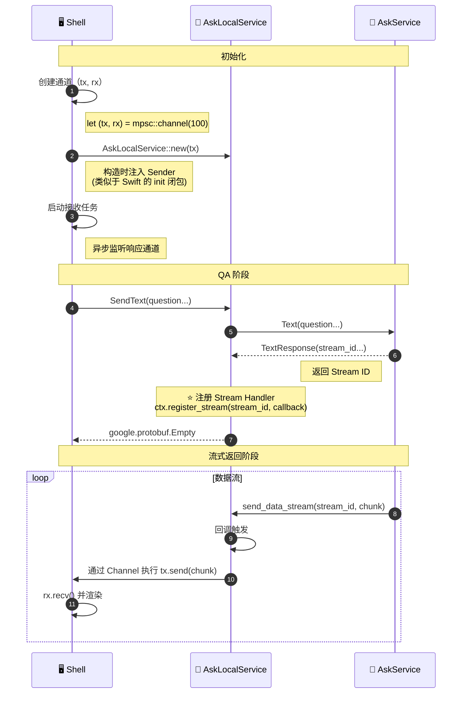
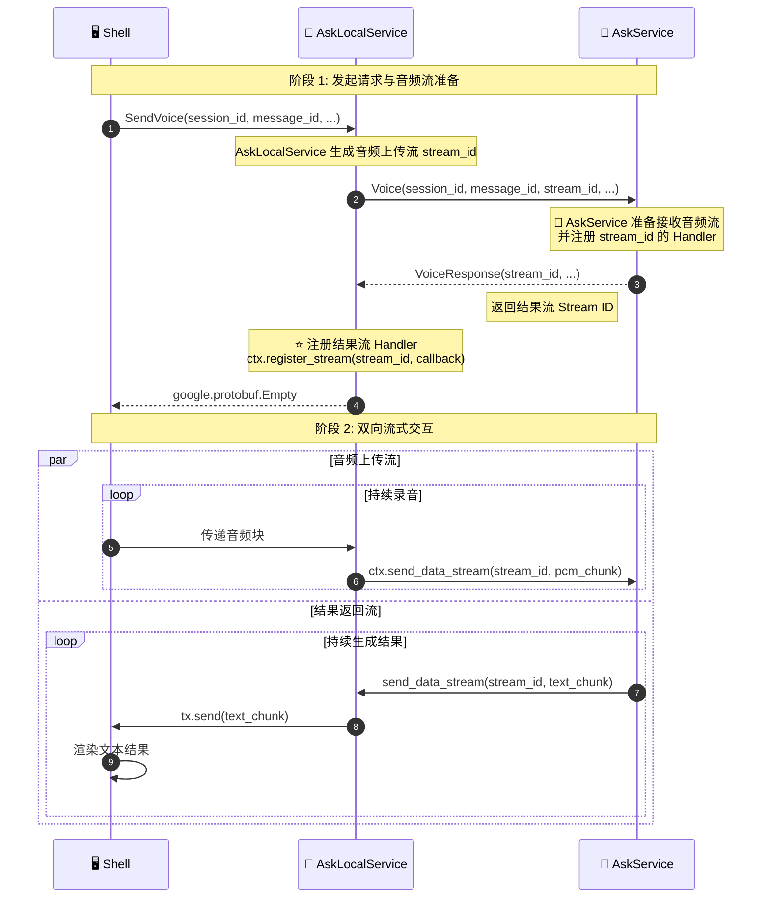

# AskC/AskS 规范说明

> 最新的 proto 定义见 [ask-service/ask.proto](./ask-service/ask.proto) 和 client-service/

本文档定义 **AskC**（客户端服务）与 **AskS**（远程服务）的交互消息标准。

## 系统架构

三层架构如下：

| 分层 | Fuse Demo | 职责 |
| --- | --- | --- |
| **展示层 (UI)** | 由客户端 UI 提供 | 用户交互、渲染 |
| **状态桥接层 / 本地 Actor** | `AskLocalService`（持有 Sender 与 UI 层通信） | 状态管理、UI 桥接、本地逻辑、流回调注册 |
| **远程 Actor** | `AskService` | 业务逻辑、数据流生成 |

## 协议定义

本节说明涉及的服务 Protobuf 定义。

> 最新的 proto 定义见 [ask-service/ask.proto](./ask-service/ask.proto) 和 client-service/

### 1. 共享类型与 AskService（`ask_service.proto`）

定义了 `Location` 消息、附件类型与 `AskService` 接口。

```protobuf
syntax = "proto3";

package qa;

// 预定义的附件类型
enum AttachmentType {
  ATTACHMENT_TYPE_UNKNOWN = 0;
  IMAGE = 1;
  DOCUMENT = 2;
  AUDIO = 3;
  VIDEO = 4;
  OTHER = 99;
}

// 附件上传准备请求
message PrepareAttachmentUploadRequest {
  string id = 1;                   // 附件唯一标识
  string filename = 2;             // 原始文件名
  AttachmentType type = 3;         // 附件类型
  string stream_id = 4;            // 附件内容使用该 DataStream 传输
  string checksum = 5;             // 原始文件字节的校验值
  string checksum_algorithm = 6;   // 例如 "md5" 或 "sha256"
  uint64 size_bytes = 7;           // 原始文件字节数
}

// 附件上传准备响应
message PrepareAttachmentUploadResponse {
  string id = 1;                   // 附件 ID（与请求中的 id 对应）
  int32 status_code = 2;           // 状态码（0 表示 stream handler 已注册）
  string error_message = 3;        // 错误信息（如果有）
}

// Shared location type
message Location {
  double latitude = 1;     // Latitude
  double longitude = 2;    // Longitude
  string address = 3;      // Optional: Address description
  string place_name = 4;   // Optional: Place name
}

// Request for text-based QA
message TextRequest {
  string question = 1;
  string session_id = 2;
  string message_id = 3;
  Location location = 4;              // Optional location context
  repeated string attachment_ids = 5; // Optional: Attachment IDs
  string version = 6;                 // Protocol version
}

// Response containing stream ID for text answer
message TextResponse {
  string stream_id = 1;    // ID for the answer data stream
  string session_id = 2;
  string message_id = 3;
  int32 status_code = 4;
  string error_message = 5;
}

// Request for voice-based QA
message VoiceRequest {
  string stream_id = 1;               // ID of the uploaded audio stream
  string session_id = 2;
  string message_id = 3;
  Location location = 4;
  repeated string attachment_ids = 5; // Optional: Attachment IDs
  string version = 6;                 // Protocol version
}

// Response containing stream ID for voice answer
message VoiceResponse {
  string stream_id = 1;    // ID for the answer audio stream
  string session_id = 2;
  string message_id = 3;
  int32 status_code = 4;
  string error_message = 5;
}

service AskService {
  // Prepares an attachment upload stream
  rpc PrepareAttachmentUpload(PrepareAttachmentUploadRequest) returns (PrepareAttachmentUploadResponse);

  // Handles text questions and returns a stream ID for the answer
  rpc Text(TextRequest) returns (TextResponse);

  // Handles voice questions and returns a stream ID for the answer
  rpc Voice(VoiceRequest) returns (VoiceResponse);
}
```

### 2. Ask Local Service（`ask_local.proto`）

定义了暴露给 Shell/UI 的本地服务接口，并通过 `ask_service.proto` 复用 `Location` 类型。

```protobuf
syntax = "proto3";

package client;

import "google/protobuf/empty.proto";
import "ask_service.proto";

// Client text message
message TextMessage {
  string question = 1;
  string session_id = 2;
  string message_id = 3;
  qa.Location location = 4;
  repeated string attachment_ids = 5;  // Optional: Attachment IDs
}

// Client voice message
message VoiceMessage {
  string session_id = 1;
  string message_id = 2;
  qa.Location location = 3;
  repeated string attachment_ids = 4;  // Optional: Attachment IDs
}

service AskLocalService {
  // Handles text input from Shell
  rpc SendText(TextMessage) returns (google.protobuf.Empty);

  // Handles voice input from Shell
  rpc SendVoice(VoiceMessage) returns (google.protobuf.Empty);
}
```

## 核心服务逻辑

### 1. AskLocalService（本地）

**角色**：本地网关。接收来自 Shell 的请求，转发到 `AskService`，并为返回的流注册本地处理器。

| 方法 | 请求 | 响应 | 说明 |
| --- | --- | --- | --- |
| `SendText` | `TextMessage` | `google.protobuf.Empty` | 处理文本输入 |
| `SendVoice` | `VoiceMessage` | `google.protobuf.Empty` | 处理语音输入 |

**关键行为**：

* **转发**：使用生成的类型安全客户端调用 `ctx.ask_service().text()`。
* **流注册**：收到 AskService 的 `stream_id` 后，调用 `ctx.register_stream(stream_id, callback)` 在本地处理数据块（例如通过 channel 发送到 Shell）。

### 2. AskService（远程）

**角色**：后端智能服务。处理查询并生成数据流。

| 方法 | 请求 | 响应 | 说明 |
| --- | --- | --- | --- |
| `PrepareAttachmentUpload` | `PrepareAttachmentUploadRequest` | `PrepareAttachmentUploadResponse` | 准备附件上传流 |
| `Text` | `TextRequest` | `TextResponse` | 文本查询逻辑 |
| `Voice` | `VoiceRequest` | `VoiceResponse` | 语音查询逻辑 |

**关键行为**：

* **附件上传准备**：注册附件 `stream_id` 的 DataStream handler，返回 ready 响应；附件内容通过后续 DataStream 分片传输，并在 EOS 后校验大小和 checksum。
* **流式发送**：使用 `ctx.send_data_stream(target, chunk)` 按增量将数据回推给调用方。
* **上下文感知**：利用请求中的 `Location` 信息。

## 详细流程（文本 QA）

**Mermaid 源代码：**



## 详细流程（语音 QA）

语音 QA 涉及音频流上传和结果流返回两个并行的流。

**Mermaid 源代码：**


